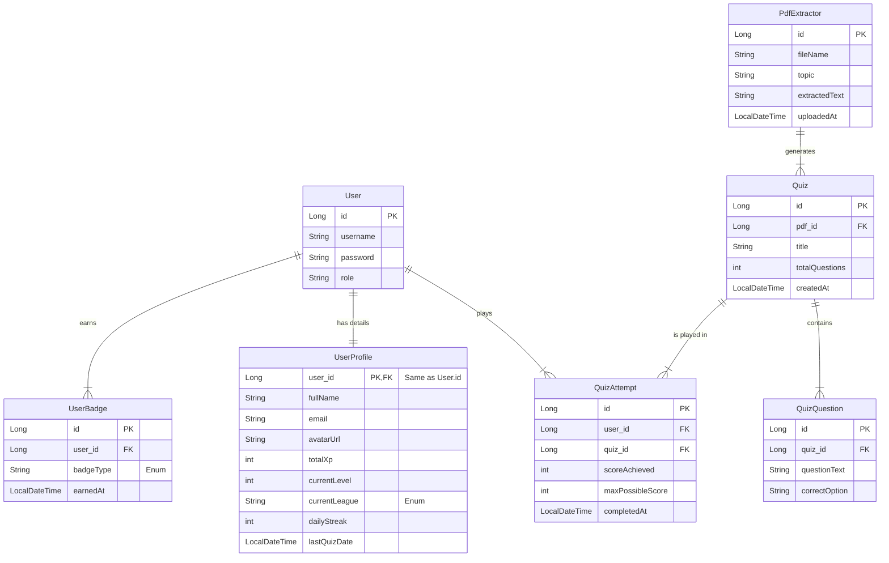

### **Entity Relationship Diagram**



---

### **Schema Explanation**

#### **1. The Core: User & UserProfile (1:1 Relationship)**

Instead of cluttering your main `User` table (which handles security/login ), we offload all gamification data to `UserProfile`.

* **Link:** The `UserProfile` shares the same Primary Key (`user_id`) as the `User`. This makes fetching profile data incredibly fast.
* **Responsibility:**
* **User Table:** Handles *Who are you?* (Authentication).
* **UserProfile Table:** Handles *How good are you?* (XP, Level, League, Streak).


#### **2. The History: QuizAttempt (Transaction Table)**

This is the bridge between your users and your content.

* **Fields:** It captures `scoreAchieved` vs `maxPossibleScore` to calculate accuracy percentages later.
* **Content Traceability:** By linking to `Quiz`, we can trace back to the `PdfExtractor`. This allows you to show users exactly which **Topic** they are strong in (e.g., "You are an expert in 'Java Basics' because you aced the quiz generated from `java.pdf`" ).


#### **3. The Rewards: UserBadge (Achievement System)**

* **Uniqueness:** The unique constraint on `(user_id, badge_type)` ensures a user cannot spam the same achievement to gain unfair rewards.
* **Flexibility:** Because we use an `Enum` for `badgeType`, you can add new badges in the Java code without needing to migrate or change the database schema structure.

#### **4. The Content Engine (Existing)**

* 
PdfExtractor: The source of truth. It holds the raw material (`extractedText`).


* 
Quiz: The structured game generated from that text.


---

### **How the Data Flows**

1. **The Trigger:** A user finishes a quiz on the frontend.
2. **The Record:** A new row is inserted into **`QuizAttempt`** linking the `User` and the `Quiz`.
3. **The Update:** The application calculates the new total score and updates `totalXp` and `dailyStreak` in **`UserProfile`**.
4. **The Check:** The `BadgeService` scans these new stats.
* *Did streak hit 7?* -> Insert row into **`UserBadge`**.
* *Did XP hit 1000?* -> Insert row into **`UserBadge`**.

```
graph TD
User[User Entity] -->|1:1| UserProfile[UserProfile Entity]
User -->|1:N| QuizAttempt[QuizAttempt Entity]
User -->|1:N| UserBadge[UserBadge Entity]

    QuizAttempt -->|N:1| Quiz[Quiz Entity]
    Quiz -->|N:1| PdfExtractor[PdfExtractor Entity]
    
    subgraph "New Data Available"
    UserProfile --> Details[Email, Full Name, Avatar]
    UserProfile --> Gamification[Total XP, League, Current Streak]
    QuizAttempt --> History[Score, Date Taken, Accuracy]
    end
```
